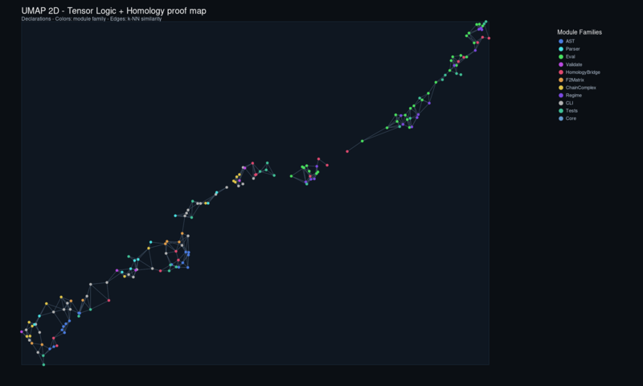
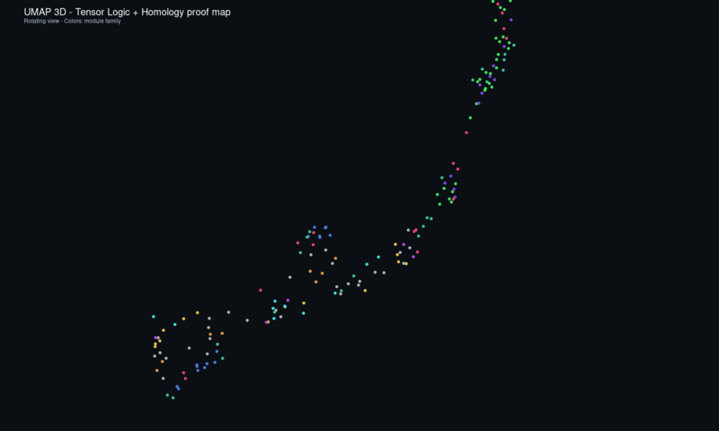

# Tensor Logic + Homology Formalization (PaperPack)

<p align="center">
  <strong>Machine-checked Datalog-style logic programs with F₂ (XOR) semantics for computable homology</strong><br/>
  <em>
    Lean 4 implementation of positive logic programs, fuzzy/boolean/F₂ evaluation modes,
    and a complete pipeline from simplicial TSV facts to Betti numbers via Gaussian elimination over F₂.
  </em>
</p>

<p align="center">
  
  
  
</p>

---

Part of the broader HeytingLean formal verification project: https://apoth3osis.io

## TL;DR

- **What:** Machine-checked tensor logic compiler + F₂ homology computation in Lean 4
- **Verify:** `cd RESEARCHER_BUNDLE && ./scripts/verify_tensor_logic.sh`
- **Demo:** `lake exe tensor_homology_cli` outputs `{"betti": [1, 0, 1]}` for the 2-sphere (S²)
- **Key insight:** Higher Betti numbers (β₁, β₂) require XOR semantics, not pure AND/OR Datalog

## Why This Matters (Computational Impact)

### The Gap Between Logic and Linear Algebra

Traditional Datalog operates over boolean or fuzzy semirings: facts combine via AND (conjunction) and aggregate via OR (disjunction). This is sufficient for reachability queries like "are vertices v₁ and v₂ connected?" — which captures β₀ (the number of connected components).

But algebraic topology demands more. The question "is this 1-cycle a boundary?" requires **XOR aggregation** (addition modulo 2), because cycle and boundary membership are linear constraints over the field F₂.

**This PaperPack bridges that gap:**

1. **Unified evaluation engine** supporting boolean, fuzzy, Heyting, and **F₂ (XOR)** modes
2. **Simplicial facts → chain complex** pipeline that converts human-readable TSV (`vertex`, `edge`, `face_edge`) into boundary matrices
3. **Computable Betti numbers** via Gaussian elimination over F₂, proving β₀ = 1, β₁ = 0, β₂ = 1 for the 2-sphere

### What You Can Do With This Now

| Task | Command | Output |
|------|---------|--------|
| Compute Betti numbers of S² | `lake exe tensor_homology_cli` | `{"betti": [1, 0, 1]}` |
| Run connectivity query | `lake exe tensor_logic_cli --rules R.json --facts F.tsv --pred connected` | All 16 connected(vᵢ,vⱼ) facts |
| Verify β₀ = 1 via reachability | `--mode boolean` | Transitive closure witnesses single component |
| Export homology encoding | `ChainComplexF2.toLogicProgram` | Facts + rules for downstream analysis |

### Future Applications

- **Persistent homology**: extend the F₂ pipeline to filtrations for topological data analysis
- **Sheaf cohomology**: combine with nucleus/Grothendieck topology layers from HeytingLean
- **Verified TDA**: machine-checked correctness for computational topology workflows
- **Differentiable logic**: bridge to tensor-based backends for gradient-based learning over logical structure

## Interactive Visualizations

<table>
  <tr>
    <td align="center" width="50%">
      <strong>2D Proof Map</strong><br/>
      <em>Pan, zoom, search declarations</em><br/>
      <a href="https://abraxas1010.github.io/tensor-logic-homology-lean/RESEARCHER_BUNDLE/artifacts/visuals/tensor_logic_2d.html">
        
      </a><br/>
      <a href="https://abraxas1010.github.io/tensor-logic-homology-lean/RESEARCHER_BUNDLE/artifacts/visuals/tensor_logic_2d.html">Open 2D Interactive</a>
    </td>
    <td align="center" width="50%">
      <strong>3D Proof Map</strong><br/>
      <em>Rotate, zoom, click nodes in 3D</em><br/>
      <a href="https://abraxas1010.github.io/tensor-logic-homology-lean/RESEARCHER_BUNDLE/artifacts/visuals/tensor_logic_3d.html">
        
      </a><br/>
      <a href="https://abraxas1010.github.io/tensor-logic-homology-lean/RESEARCHER_BUNDLE/artifacts/visuals/tensor_logic_3d.html">Open 3D Interactive</a>
    </td>
  </tr>
</table>

<details>
<summary>Static SVG Previews (full resolution)</summary>

- [2D UMAP (SVG)](RESEARCHER_BUNDLE/artifacts/visuals/tensor_logic_2d_preview.svg)
- [3D Animated (SVG)](RESEARCHER_BUNDLE/artifacts/visuals/tensor_logic_3d_preview_animated.svg)
- [3D Static (SVG)](RESEARCHER_BUNDLE/artifacts/visuals/tensor_logic_3d_preview.svg)

</details>

**Module Dependency Graph:**
```
AST → ParseFacts / ParseRulesJson → Validate → Eval
                                        ↓
                              Mode.boolean / .fuzzy / .f2 / .heyting
                                        ↓
                              tensor_logic_cli

F2Matrix → ChainComplex → HomologyFromFacts → tensor_homology_cli
                ↓
         HomologyEncoding (facts + connectivity rules)
```

## Key Results

### Evaluation Modes

| Mode | AND | OR | Use Case |
|------|-----|-----|----------|
| `boolean` | ∧ (crisp) | ∨ (crisp) | Reachability, β₀ |
| `fuzzy` | t-norm | t-conorm | Probabilistic inference |
| `heyting` | min | max | Intuitionistic semantics |
| `f2` | ∧ (crisp) | **XOR** | Linear algebra over F₂, β₁/β₂ |

### Betti Number Computation

The 2-sphere S² (boundary of tetrahedron) demonstrates the full pipeline:

```lean
-- Built-in demo: 4 vertices, 6 edges, 4 faces
lake exe tensor_homology_cli
-- Output:
-- {"meta": {"demo": true, "maxDim": 2, "d2_ok": true},
--  "dims": [4, 6, 4],
--  "boundary_ranks": [3, 3],
--  "betti": [1, 0, 1]}
```

**Mathematical verification:**
- β₀ = 4 - rank(∂₁) = 4 - 3 = 1 (one connected component)
- β₁ = 6 - rank(∂₁) - rank(∂₂) = 6 - 3 - 3 = 0 (no 1-dimensional holes)
- β₂ = 4 - rank(∂₂) = 4 - 3 = 1 (one 2-dimensional void — the "inside" of the sphere)

This matches the known homology: H₀(S²) ≅ Z, H₁(S²) = 0, H₂(S²) ≅ Z.

### Key Theorems (Sanity-Checked)

```lean
-- Connectivity witnesses β₀ = 1
example : allConnected = true := by native_decide
-- (LogicEncodingSanity.lean)

-- F2 XOR mode sanity
example : xorAggregationCorrect = true := by native_decide
-- (F2Sanity.lean)
```

## What This PaperPack Delivers

### Achieved (Machine-Checked)

- **Positive logic programs**: AST, TSV facts parser, JSON rules parser, validation
- **Multi-mode evaluation**: boolean, fuzzy (product/Łukasiewicz), Heyting (Gödel), F₂ (XOR)
- **F₂ linear algebra**: `F2Matrix` with XOR Gaussian elimination, rank computation
- **Chain complex structure**: `ChainComplexF2` with ∂² = 0 verification, Betti computation
- **Simplicial bridge**: `HomologyFromFacts` converts TSV (`vertex`, `edge`, `face_edge`) to boundary matrices
- **Homology → logic encoding**: `ChainComplexF2.toLogicProgram` emits facts + connectivity rules
- **CLI tools**: `tensor_logic_cli`, `tensor_homology_cli`, `homology_cli`

### Model Assumptions

| Assumption | Rationale |
|------------|-----------|
| **Positive rules** | No negation; ensures monotonicity and least-fixed-point semantics |
| **Finite facts** | Ground atoms only; no function symbols or infinite domains |
| **F₂ coefficients** | Homology over the 2-element field; sufficient for Betti number parity |
| **≤2-dimensional** | Current `HomologyFromFacts` handles vertices, edges, faces; extensible |

### What Is NOT Claimed

- **Stratified negation**: Not yet implemented (roadmap item)
- **Tensor compilation**: Interpreter-based, not compiled to einsum/tensor ops
- **Learned predicates**: No neural/embedding integration yet
- **Persistent homology**: Single snapshot, not filtrations

### Future Research Directions

1. **Stratified negation**: Safe extension for non-monotonic reasoning
2. **Tensor codegen**: Compile rules to einsum-style operations
3. **Persistent homology**: Extend to filtrations for TDA
4. **Higher dimensions**: Generalize `HomologyFromFacts` beyond dim 2
5. **Sheaf integration**: Connect to HeytingLean's nucleus/Grothendieck layers

## How To Verify (Local)

```bash
cd RESEARCHER_BUNDLE
./scripts/verify_tensor_logic.sh
```

Or manually:

```bash
cd RESEARCHER_BUNDLE
lake build --wfail
lake exe tensor_homology_cli
lake exe tensor_logic_cli --rules data/homology/sphere2_as_logic.rules.json \
                          --facts data/homology/sphere2_as_logic.facts.tsv \
                          --mode boolean --pred connected
```

## Repository Structure

```
tensor-logic-homology-lean/
├── README.md                     # This file
├── lakefile.lean                 # Wrapper for repo root
├── lean-toolchain                # Lean 4 version
├── docs/                         # PNG thumbnails
│   ├── tensor_logic_2d_thumb.png
│   └── tensor_logic_3d_thumb.png
└── RESEARCHER_BUNDLE/            # Self-contained verification
    ├── lakefile.lean
    ├── lean-toolchain
    ├── scripts/
    │   ├── verify_tensor_logic.sh
    │   └── generate_umap_previews.py
    ├── data/homology/
    │   ├── sphere2_as_logic.facts.tsv
    │   ├── sphere2_as_logic.rules.json
    │   └── sphere2_tetrahedron_boundary.json
    ├── artifacts/visuals/
    │   ├── tensor_logic_2d_preview.svg
    │   ├── tensor_logic_3d_preview.svg
    │   ├── tensor_logic_3d_preview_animated.svg
    │   └── tensor_logic_proofs.json
    └── HeytingLean/
        ├── Compiler/TensorLogic/
        │   ├── AST.lean
        │   ├── ParseFacts.lean
        │   ├── ParseRulesJson.lean
        │   ├── Validate.lean
        │   ├── Eval.lean
        │   ├── HomologyEncoding.lean
        │   ├── HomologyFromFacts.lean
        │   └── Regime.lean
        ├── Computational/Homology/
        │   ├── F2Matrix.lean
        │   └── ChainComplex.lean
        ├── CLI/
        │   ├── TensorLogicMain.lean
        │   ├── TensorHomologyMain.lean
        │   └── HomologyMain.lean
        └── Tests/
            ├── TensorLogic/{Sanity,F2Sanity,AllSanity}.lean
            └── Homology/{Sanity,LogicEncodingSanity,AllSanity}.lean
```

## Input Formats

### Facts (TSV)

```tsv
# Vertices
vertex	v0
vertex	v1
# Edges
edge	v0	v1
# Face-edge incidence
face_edge	f012	v0	v1
```

### Rules (JSON)

```json
[
  {"head": "connected", "args": ["V", "V"], "body": [{"pred": "vertex", "args": ["V"]}]},
  {"head": "connected", "args": ["V1", "V2"], "body": [{"pred": "edge", "args": ["V1", "V2"]}]}
]
```

## Mathematical Foundation

### From Datalog to Homology

The key insight: **graph connectivity (β₀) is expressible in pure Datalog**, but **cycle/boundary membership (β₁, β₂) requires XOR**.

For a simplicial complex with boundary operator ∂:
- **Cycles**: Zₖ = ker(∂ₖ) — chains with zero boundary
- **Boundaries**: Bₖ = im(∂ₖ₊₁) — chains that are boundaries of higher chains
- **Homology**: Hₖ = Zₖ / Bₖ — cycles modulo boundaries

Over F₂, these are **linear subspaces**, and membership is determined by **XOR (addition mod 2)** equations.

### Why F₂?

Working over F₂ (the field with two elements) has several advantages:
1. **Simplicity**: No sign tracking (−1 = +1 in F₂)
2. **Efficiency**: XOR is fast; Gaussian elimination is O(n³)
3. **Sufficiency**: Betti numbers mod 2 capture the essential topology

For torsion-sensitive applications, one would extend to Z or Q coefficients.

## Axiom Footprint

Standard Lean kernel axioms only:

| Axiom | Purpose |
|-------|---------|
| `propext` | Propositional extensionality |
| `Quot.sound` | Quotient soundness |

**No project-specific axioms introduced.**

## References

1. Cohen, W. W. (2016). "TensorLog: A differentiable deductive database." arXiv:1605.06523.

2. Hatcher, A. (2002). *Algebraic Topology*. Cambridge University Press.

3. nLab: "simplicial homology", "Datalog", "F₂ (field)"

---

<p align="center">
  Part of the <a href="https://apoth3osis.io">HeytingLean</a> formal verification project
</p>
